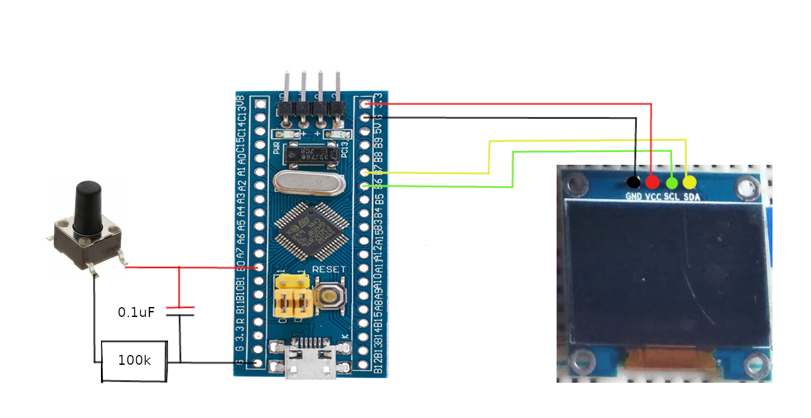

# STM32F103C8T6 Project with SSD1306 Display

## Project Description

This project serves as an example of using the STM32F103C8T6 microcontroller with an SSD1306-controlled display. The project includes the initialization of two bitmaps: one with the inscription "HELLO" and the other empty. It also involves calling assembler functions to configure the microcontroller's clock, peripherals, and interrupts.

## Project Files

- **main.c:** The main project file where the bitmaps are initialized and assembler functions are called.
- **asmInterruptWFI.s:** A file with assembler functions, including the configuration of the SSD1306 chip and the redefinition of the interrupt handler for the EXT0 line. Inside the interrupt handler, an empty or filled bitmap is loaded into the SSD1306 memory depending on the signal level at the B0 output.

## Bitmap Initialization

Two bitmaps are initialized in the `main.c` file: one with the "HELLO" inscription, and the other empty. These bitmaps can be used to display information on the SSD1306 display.

## Assembler Functions

- **asmClockEnable:** Function to enable the HSI generator and configure the system clock source.
- **asmSetRegistr:** Function to set a bit in the register.
- **asmResetRegistr:** Function to reset a bit in the register.
- **asmWhileBeq:** Function to wait for a bit to be set in the register.
- **asmI2cEnable:** Function to enable the I2C interface.
- **asmInterruptWFI:** Function to enable the wait-for-interrupt mode.

## SSD1306 Configuration

The `asmInterruptWFI.s` file contains code for configuring the SSD1306 display. The interrupt handler for the EXT0 line is redefined and used to load a bitmap into the SSD1306 memory depending on the signal level at the B0 output.

## Schematic diagram


## Dependencies

The project is developed using the STM32CubeIDE library. Please ensure that you have the necessary libraries and settings for compiling and flashing the code to your microcontroller.

## Usage

1. Clone the repository:

```bash
git clone git@github.com:Pavel1996git/stm32_ssd1306_assambler.git

## License

This project is distributed under the MIT license. Please refer to the `LICENSE` file for additional information.

